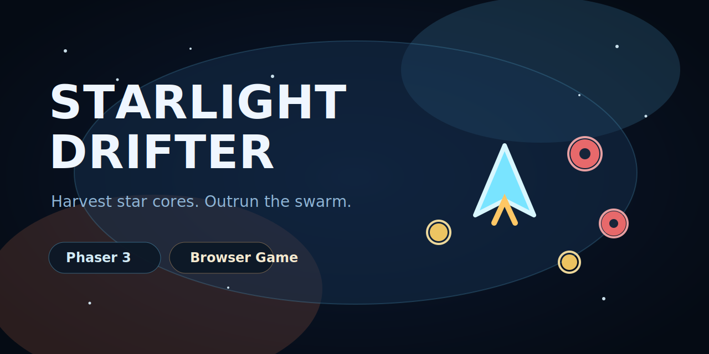
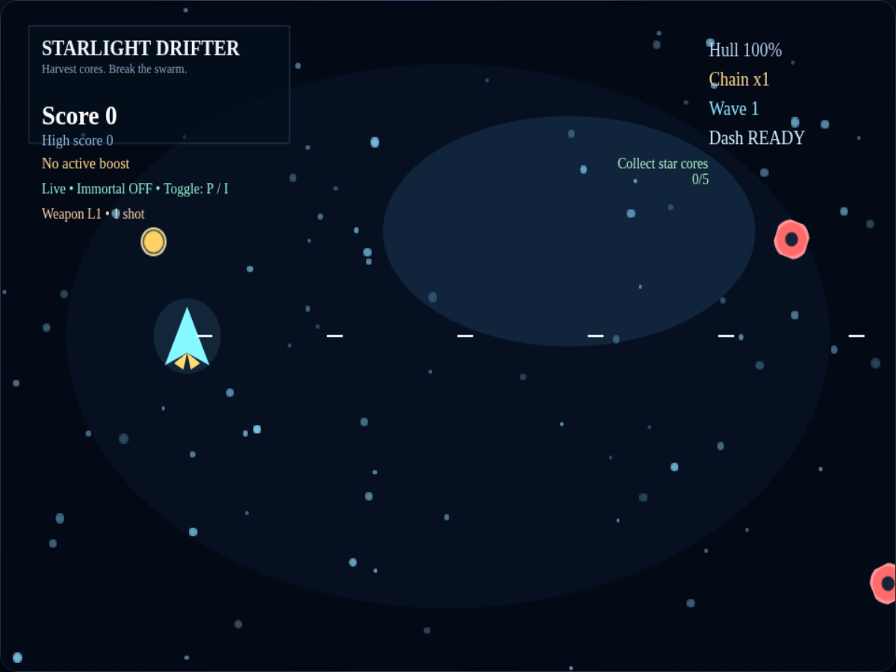
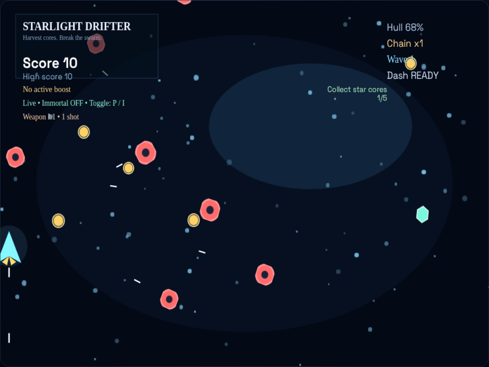
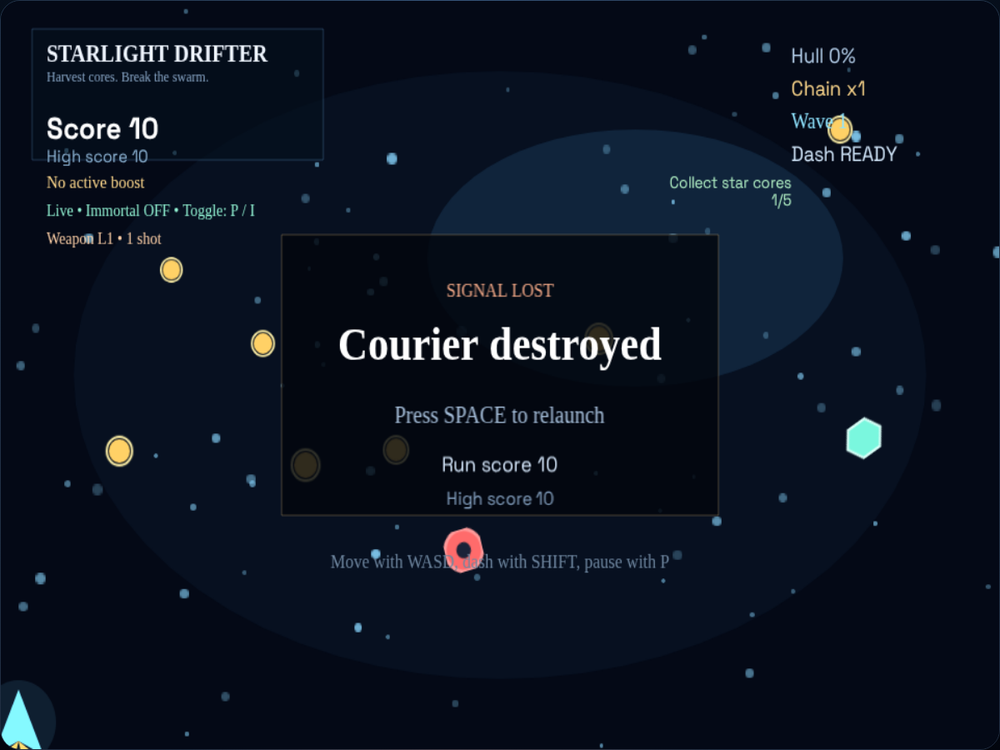

# Starlight Drifter

A neon browser arcade game about harvesting star cores while surviving escalating drone swarms.

## Game Glimpse









## Play Loop

- Pilot the courier ship with `WASD` or the arrow keys.
- Collect glowing star cores to raise score, restore hull, and build your score chain.
- Avoid hunter drones as each wave ramps up the spawn pressure.
- Press `Space` after destruction to restart instantly.

## Run

```bash
npm install
npm run dev
```

## Build

```bash
npm run build
```

## Test

```bash
npm test
```

## Deploy

This repo includes a GitHub Pages workflow.

After pushing to `main`, enable Pages in the repository settings with:

- Source: `GitHub Actions`

The site will publish at:

`https://js-castro.github.io/starlight-drifter/`

Suggested GitHub repo description:

`Neon browser arcade game about harvesting star cores and surviving drone swarms.`
